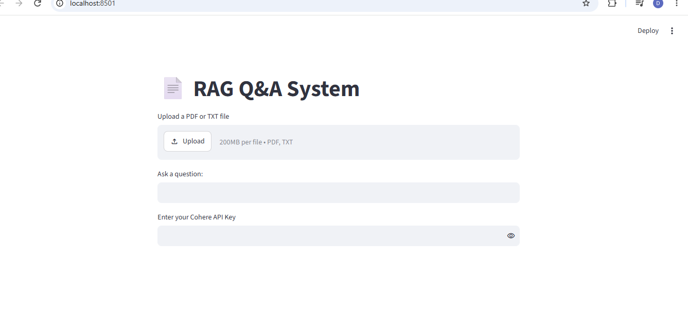
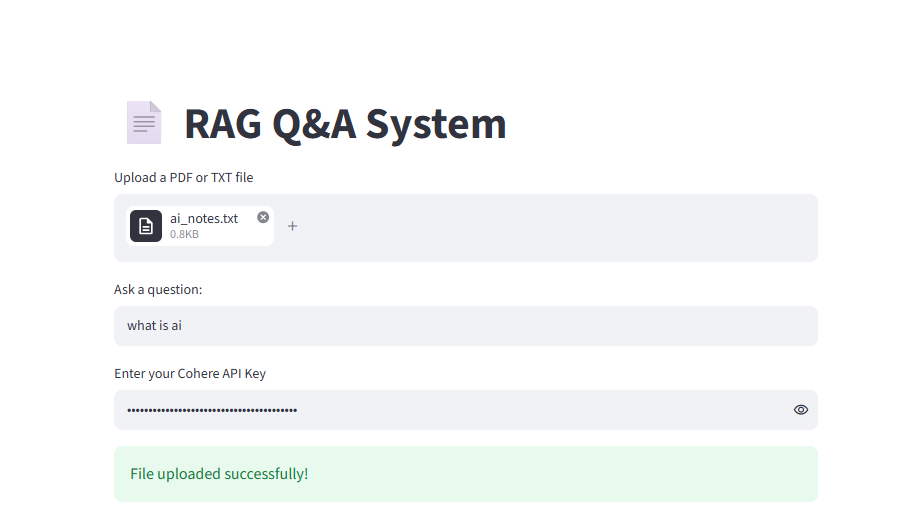
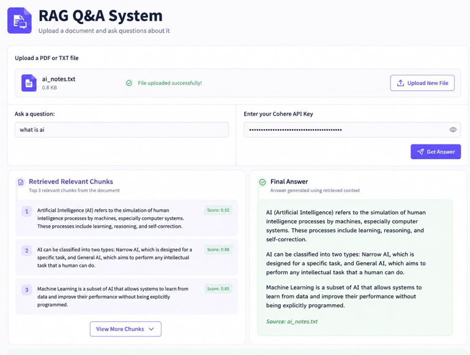

# RAG Assignment

## Overview
This is a Retrieval-Augmented Generation (RAG) system built using Streamlit.

# RAG Q&A System

## Features
- Upload PDF or TXT files
- Ask questions from the uploaded document
- Uses Cohere embeddings
- Streamlit interface

## Screenshots

### Home Page

### File Uploaded

### Final Interface

## How to Run

pip install -r requirements.txt  
streamlit run app.py

## Project Structure

rag_assignment/
├── app.py
├── functions.py
├── requirements.txt
├── README.md
└── screenshots/